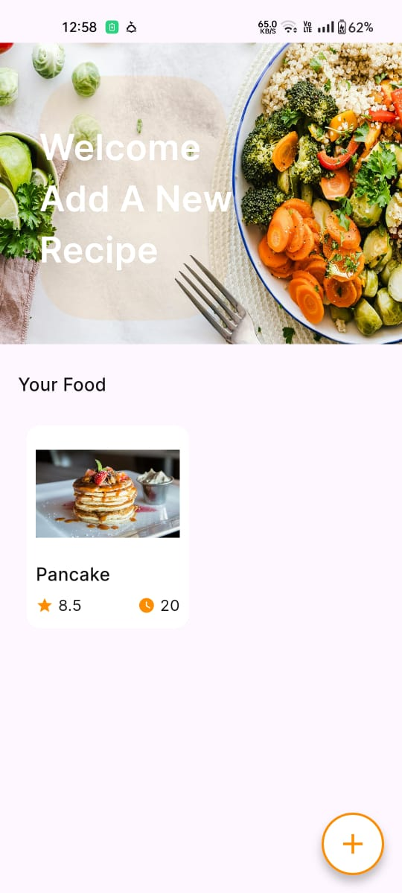
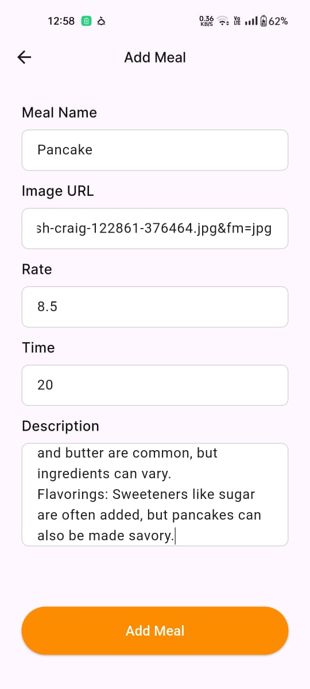
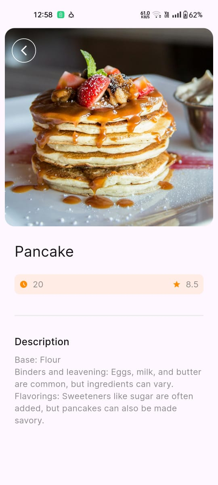

# 🍽 Meals App

A Flutter application to manage meals with onboarding, add meal functionality, meal details, and local database integration using **Sqflite**.


## 🌟 Features

- **Onboarding:** Smooth introduction to app features
- **Add Meal:** Add meals with name, description, and rating
- **Home Screen:** List all meals stored in the local database
- **Meal Details:** View ingredients, description, and rating
- **Local Database:** Meals are stored using SQLite (sqflite)
- **Reusable Widgets:** Custom text fields, buttons, spacing, and background image
- **Clean Project Structure:** Core utilities separated from features


## 📸 Screenshots

### **🛠 Onboarding Screens**
| Onboarding 1 | Onboarding 2 | Onboarding 3 |  
|--------------|--------------|--------------|  
|  |  |  |  

---

### **⚙️ Main Home Screens**
| Main Home 1 | Main Home 2                                          |  
|-----------------|----------------------------------------------------------|  
|  |  |  

---

### **🏆 Add Meal Screen**
| Add Meal Screen                                  |  
|--------------------------------------------------|  
|  |  

---

### **🏆 Details Screen**
| Details Screen                                            |  
|-----------------------------------------------------------|  
|  |  


## 🛠️ Tech Stack

- Framework: **Flutter**
- State Management: Native (setState)
- Database: **Sqflite**
- Architecture: Feature-based + MVC


## 🚀 Getting Started

### Prerequisites

- Flutter SDK (Version 3.0 or higher)
- Dart SDK (Version 2.17 or higher)
- Android Studio / VS Code
- Git

### Installation

1. Clone the repository
```bash
   git clone https://github.com/AhmedHafez32/meals_app
```

2. Navigate to project directory
```bash
   cd meals_app
```
3. Install dependencies
```bash
   flutter pub get
```
4. Run the app
```bash
   flutter run
```
## 📁 Project Structure
```

lib/
├── core/
│   ├── assets/
│   │   └── app_assets.dart
│   ├── routing/
│   │   ├── app_routes.dart
│   │   └── router_generation_config.dart
│   ├── styles/
│   │   ├── app_colors.dart
│   │   ├── app_fonts.dart
│   │   └── app_styling.dart
│   └── widgets/
│       ├── custom_background_image.dart
│       ├── custom_text_field.dart
│       ├── primary_button_widget.dart
│       └── spacing_widgets.dart
│
├── features/
│   ├── add_meal_screen/
│   │   ├── widget/
│   │   │   ├── custom_text_field.dart
│   │   │   └── primary_button_widget.dart
│   │   └── add_meal_screen.dart
│   │
│   ├── home_screen/
│   │   ├── data/
│   │   │   ├── db_helper/
│   │   │   │   └── db_helper.dart
│   │   │   └── model/
│   │   │       └── food_model.dart
│   │   ├── widgets/
│   │   │   └── home_screen.dart
│   │
│   ├── meal_details_screen/
│   │   ├── widget/
│   │   │   └── custom_time_rate_widget.dart
│   │   └── meal_details_screen.dart
│   │
│   └── on_boarding_screen/
│       ├── on_boarding_services/
│       │   └── on_boarding_servies.dart
│       └── on_boarding_screen.dart
│
└── main.dart
```

## 🎯 Features in Detail

**Onboarding**
Introduction to app features
Skip option available

**Add Meal**
Add a new meal with details
Save data to local database

**Home Screen**
Display all meals from SQLite
Navigate to details of each meal

**Meal Details**
Show full information about the meal
Display rating widget

**Database Helper**
Singleton pattern for DB
Insert, fetch, and delete meals


## 🔧 Configuration
```

Dependencies used in pubspec.yaml
dependencies:
  flutter:
    sdk: flutter
    google_fonts: ^6.3.1
  go_router: ^16.2.1
  dots_indicator: ^4.0.1
  carousel_slider: ^5.1.1
  shared_preferences: ^2.5.3
  path: ^1.9.1
  sqflite: ^2.4.2
  cached_network_image: ^3.4.1

```
## 👨‍💻 Author

**Ahmed Hafez**

- GitHub: [AhmedHafez32](https://github.com/AhmedHafez32)
- LinkedIn: [ahmedhafez47](https://www.linkedin.com/in/ahmedhafez47/)
